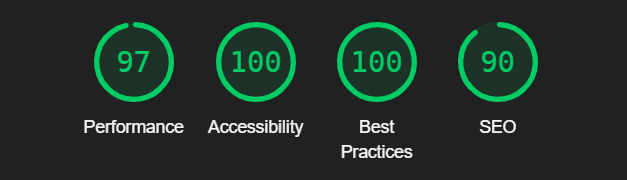

Contents
## Button clicking

User stories

> As a User, I want to click the button
Title: User Clicks Button

Description: As a user, I want to click a button so that I can participate in the button-clicking activity.

Acceptance Criteria:

A button is visible on the website.

Clicking the button increases the click count by one.

The click count is updated and displayed on the screen immediately.

> As a User, I Want to See My Click Count
Title: User Views Click Count

Description: As a user, I want to see the number of times I have clicked the button so that I can track my progress.

Acceptance Criteria:

The current click count is displayed on the screen.

The click count is updated in real-time as I click the button.


> As a User, I Want to See a Leaderboard
Title: User Views Leaderboard

Description: As a user, I want to see a leaderboard that shows the top clickers so that I can compare my performance with others.

Acceptance Criteria:

A leaderboard is visible on the website.

The leaderboard displays the top users' names and their click counts.

The leaderboard is updated in real-time as users click the button.

> As an Admin, I Want to Monitor Overall Clicks
Title: Admin Monitors Overall Clicks

Description: As an admin, I want to monitor the total number of clicks on the website so that I can analyze user engagement.

Acceptance Criteria:

An admin dashboard displays the total number of clicks.

The total click count is updated in real-time as users click the button.

>  As a User, I Want to Receive Feedback on My Clicks
Title: User Receives Click Feedback

Description: As a user, I want to receive feedback (e.g., a sound or visual effect) when I click the button so that I know my click was registered.

Acceptance Criteria:

A feedback mechanism (sound, animation, or visual effect) is triggered upon each click.

The feedback is immediate and indicates the click was successful.

>  As a User, I Want to See My Click History
Title: User Views Click History

Description: As a user, I want to see my click history so that I can track my clicking activity over time.

Acceptance Criteria:

A history section displays the timestamps of my clicks.

The history is updated in real-time as I click the button.

## Use case
### Social Engagement Platform
Objective:
Create an engaging and interactive platform that encourages users to participate in a fun, collective activity, fostering a sense of community and competition.

Target Audience:
Social Media Enthusiasts: Individuals who enjoy participating in viral trends and social experiments.

Gamers: People who enjoy simple games and challenges.

Community Builders: Organizers looking to create a sense of camaraderie and engagement within their groups or organizations.

### Proof of principle - secure passing of variables

While my project passes a click model, it does so by passing stringified JSON objects, complete with csrf tokens. A user and their clicks are strongly associated, and should there exist some method of taking
clicks from another user, they would fail to be validated correctly. The code block that deals with this follows below - 

```
 clickButton.addEventListener('click', () => {
            fetch("", {
                method: 'POST',
                headers: {
                    'Content-Type': 'application/json',
                    'X-CSRFToken': '{{ csrf_token }}'
                },
                body: JSON.stringify({})
            })
            .then(response => response.json())
            .then(data => {
                if (data.click_count !== undefined) {
                    clickCountDisplay.textContent = data.click_count;
                }
            })
            .catch(error => console.error('Error:', error));
```

This approach made it helpful to set a CSRF_TRUSTED_ORIGINS variable in settings.py pointing to my development server. While not relevant in production code, it was left in to help demonstrate testing methods.

### Custom views - a novel method of incrementing

While it may not be the most efficient way to increment a variable, as a demonstration of the flexibility of Django, a user's click count is incremented using the custom page view below -

```
def increment_click_count(request):
    if request.method == 'POST':
        click, created = Click.objects.get_or_create(user=request.user)
        click.count += 1
        click.save()
        return JsonResponse({'click_count': click.count})
    return JsonResponse({'error': 'Invalid request'}, status=400)
```    
## Tests
### WAVE Testing


The low element-per-page and high constrast, accesible design features helped immensely, and intelligent use of colour. <br><br>


### HTML Validation

This was done with the W3schools html validator, input with copied source to avoid Django issues.


<br><br>

### CSS Validation

This was done with the W3schools css validator.


<br><br>

### Lighthouse Validation

This was achieved with Chrome's inbuilt developer tools



## Deployment

Deployment was handled on Heroku. This necessitated the creation of a Procfile, used to specify guinicon handling, and the setting of 
environment variables on that platform, namely DISABLE_COLLECTSTATIC and SECRET_KEY. 
Deploying in this way also meant static files had to be served by some external service, and for this purpose Whitenoise was installed,
and the approprite lines added to settings.py (below)
```
STATIC_URL = 'static/'
STATIC_ROOT = os.path.join(BASE_DIR, 'staticfiles')

STATICFILES_DIRS = (os.path.join(BASE_DIR, 'static'),)
STATICFILES_STORAGE = 'whitenoise.storage.CompressedManifestStaticFilesStorage'
```

Secret key handling was performed locally by defining a %SECRET_KEY% as a global enviroment variable, and adding env.py to gitignore,
ensuring that the secret key has never been in a publicly accesable place, either on Heroku or in the public development repository.


## Learning Objectives

### LO1

1.1 Front end design - <br>
This was achieved with bespoke CSS, designed from the ground up to be responsive using Flexbox.
I used few, high contrast colours to achieve accesibility and readability criteria.
<br>
1.2 Database - <br>
I linked the deployed Django project to a provided PostGRES server.
<br>
1.3 Agile Methodology - <br>
Extensive use was made of the linked Project board, and the plan was adapted according to testing, validation and expert advice.
<br>
1.4 Code Quality - <br>
1.5 Documentation - <br>
<br>
<br>

### LO2

2.1 Database Development - <br>
Data is typed, and has both default values and validation measures upon editing. User preferences (button text) is created wih default
values upon account creation, or on login if the associated account has no user preferences.
<br>
2.2 CRUD Functionality - <br>
Create -<br> User account, click count and user preferences. <br>
Read -<br> User preferences are reflected in the button text, and click count is reflected in both the main button page, and the leaderboard. On the leaderboard, it is also associated with the username. <br>
Update - <br> The click count updates on button click, and the button text can be updated with a form. <br>
Delete - <br> The 'delete' link on the button text form deletes the user preference record, leaving the button blank.
Userpreference is created on login, register or editing of the button text, but it is possible to delete the userpreference and click the button with normal functionality with the link supplied on the 'update button text' form. The relevant delete view is included below for clarity.
<br>
```
@login_required
def delete_preference(request):
    preference = get_object_or_404(UserPreference, user=request.user)
    if preference.user == request.user:  # Ensure users can only delete their own preferences
        preference.delete()
    return redirect('index')  # Redirect to the index page   
```
<br>
2.3 User Notifications - <br>
The User is notified upon succesful login, by progress to main site, notified of each buton click with the CSRF token counter, and
notifed upon successful button text change, or deletion of the button text record, by redirecting to the main page with the appropriate 
change implemented.
<br>
2.4 Forms and Validation - <br>
There are several forms in the project. The 'Register' form has password fields validated by allauth, and the 'change button text' form 
has validation to prevent an empty entry, to help distinguish clearing a stored text string, and deleting the record of that text string
<br>

### LO3

3.1 Role Based Login and Registration - <br>
The project makes it's online form register respondents as users. The admin has a superuser account, and can use the Django backend to
promote other users to superusers, as and when the need arises. User accounts are protected within the app by CSRF tokens.<br>

3.2 Reflect Login State - <br>
The project's only functionality for non-logged in users is to either login or register. The login state is reflected in site 
functionality, e.g the ability to click the button.<br>

3.3 Access Control - <br>
Access control is achieved in a couple of ways. Lines such as the below -
`if preference.user == request.user:  # Ensure users can only delete their own preferences`
ensure that a user only has access to their own preferences record. 
The code block below 
```
 headers: {
                    'Content-Type': 'application/json',
                    'X-CSRFToken': '{{ csrf_token }}'
                },
```
demonstrates another method, this exerpt from index.html showing the passing of CSRF tokens in the header. This ensures that clicks are
strongly associated with a particular user <br>

### LO4

### LO5

5.1 Version Control with Git and Github - <br>
This repository is hosted on github, and was worked on locally on VScode. The project was confirmed working locally where possible 
before uploading to github, ensuring all commits after major functionality changes are stable.<br>

5.2 Secure Code Management - <br>
The necessary SECRET_KEY variable is stored in env.py, which is then added to .gitignore. For remote hosting on Heroku, a different 
secret key was used, protected with Heroku's mandatory two-factor authentication. <br>

### LO6

6.1 Deploy Application to Cloud Platform - <br>
The application can be found on Heroku, at this link https://buttonclickerapp-692aa9d470e4.herokuapp.com/
<br>

6.2 Document Deployment Process - <br>
The deployment process can be found in this document - [Link here](#deployment)
<br>

6.3 Ensure Security in Deployment - <br>
No passwords or secret keys were part of my repository at any commit. py.env was added to gitignore, and the assigned SECRET_KEY was 
removed from the project prior to the earliest relevant commit to a public repository. <br>

### LO7 

7.1 Design and Implement a Custom Data Model - <br>

The models designed for this project are included below. It would have been possible to unify these models, but this implementation 
demonstrates different ways of inheriting into a custom model

```

class Click(models.Model):
    user = models.ForeignKey(User, on_delete=models.CASCADE)
    count = models.IntegerField(default=0)
    created_at = models.DateTimeField(auto_now_add=True)
    updated_at = models.DateTimeField(auto_now=True)

    def __str__(self):
        return f"{self.user.username} - {self.count}"

class UserPreference(models.Model):
    user = models.OneToOneField(User, on_delete=models.CASCADE)
    button_text = models.CharField(max_length=100, default='Click Me!')

    def __str__(self):
        return self.user.username
```

The click and UserPreference returns are not currently used, and are left in place for future features. The leaderboard pulls from the 
click model directly.