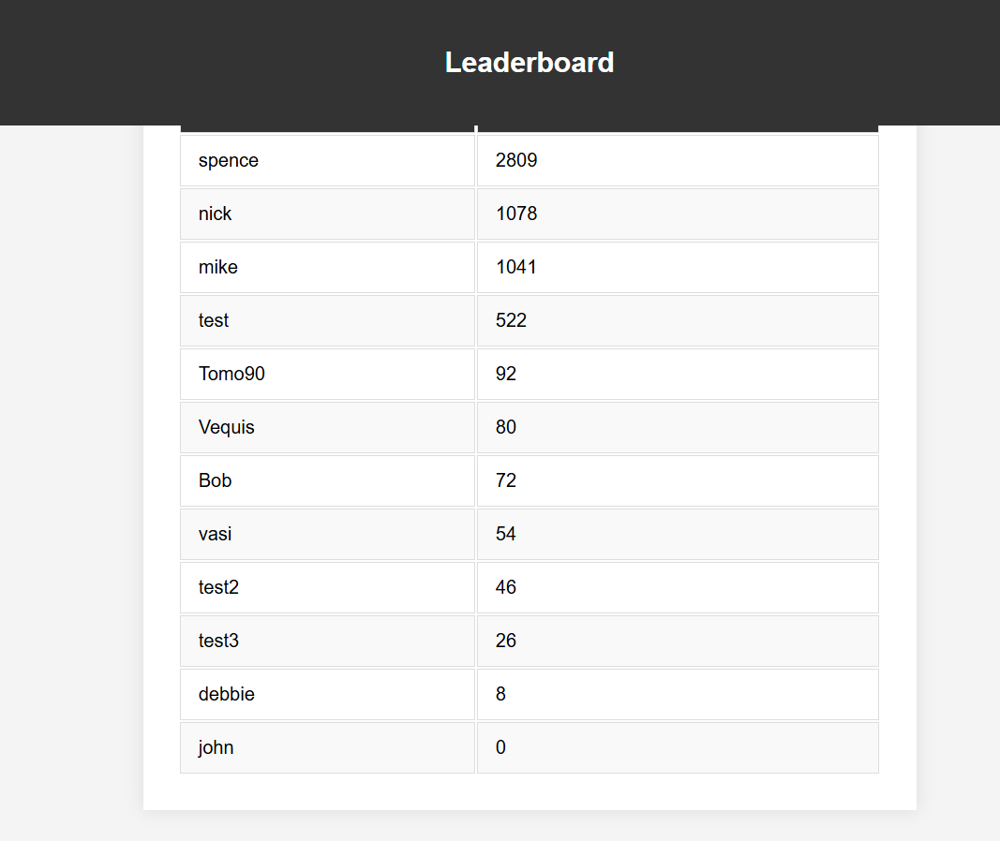

# Button clicking

[Click the button at my deployment link!](https://buttonclickerapp-692aa9d470e4.herokuapp.com/)

## Table of Contents

- [Button clicking](#button-clicking)
  - [Use case - Social Engagement Platform](#use-case---social-engagement-platform)
  - [Recreating the project](#recreating-the-project)
  - [ERD overview](#erd-overview)
  - [Wireframing](#wireframing)
  - [Website screenshots](#website-screenshots)
  - [Responsive design](#responsive-design)
  - [Proof of principle - secure passing of variables](#proof-of-principle---secure-passing-of-variables)
  - [Custom views - a novel method of incrementing](#custom-views---a-novel-method-of-incrementing)
- [Tests](#tests)
  - [Automated unit testing](#automated-unit-testing)
  - [WAVE Testing](#wave-testing)
  - [HTML Validation](#html-validation)
  - [CSS Validation](#css-validation)
  - [Lighthouse Validation](#lighthouse-validation)
- [Deployment](#deployment)
- [Learning Objectives](#learning-objectives)
  - [LO1](#lo1)
  - [LO2](#lo2)
  - [LO3](#lo3)
  - [LO4](#lo4)
  - [LO5](#lo5)
  - [LO6](#lo6)
  - [LO7](#lo7)
  - [LO8](#lo8)
- [User stories](#user-stories)
- [Thanks](#thanks)


## Use case - Social Engagement Platform
Objective:
Create an engaging and interactive platform that encourages users to participate in a fun, collective activity, fostering a sense of community and competition.

Target Audience:
Social Media Enthusiasts: Individuals who enjoy participating in viral trends and social experiments.

Gamers: People who enjoy simple games and challenges.

Community Builders: Organisers looking to create a sense of camaraderie and engagement within their groups or organizations.

It also serves as a proof-of-concept for the security features of Django, using secure CSRF to administer button clicks in this case,
but those measures could be used to protect sensitive data of all kinds.

### Recreating the project

1. Clone the repo to your local machine with git clone
2. Set up a venv with `python -m venv venv` and activate it with your OS specific method
3. Install requirements with `pip install -r requirements.txt`
4. Create a file named env.py in the project root directory and add the necessary environment variables. <br>
`os.environ['DATABASE_URL'] = 'your_database_url_here'` <br>
`os.environ['SECRET_KEY'] = 'your_secret_key_here'` <br>
Make sure to add `#import env` to settings.py <br>
5. Use `python manage.py migrate` to build the database schema
6. Create a superuser with `python manage.py createsuperuser`
7. Run the development server with `python manage.py runserver`
8. Open your web browser and go to http://localhost:8000 to access the application.

### ERD overview

The project uses models outlined in the following entity relationship diagram - 
 


The created_at and updated_at fields are automatically populated, but not currently used. A future feature was planned around them, to 
map periods of downtime across users.

### Wireframing

The design was clean, high contrast and with few elements. The project retained these philosophies through to the final product.
Monochrome design emphasizes simplicity, reducing visual clutter and distractions. This creates a clean, straightforward interface that's easy for users to navigate.
By using a single color scheme, the focus remains on the content and functionality. Users can quickly understand what actions they need to take without being overwhelmed by too many colors.
Monochrome designs often convey a modern, sophisticated, and professional look. This can give your project a sleek, contemporary feel that appeals to users who appreciate minimalism.
Using one primary color ensures consistency across the entire application. This uniformity can make the app feel more cohesive and well-integrated.
Monochrome design can enhance readability, especially when combined with high contrast. This can make your app more accessible to users with visual impairments or those who prefer clean, easily readable interfaces.
Monochrome designs can make bold statements by leveraging contrast effectively. Important elements like buttons or alerts stand out more when they are the only elements with a different shade or a pop of color.


### Website screenshots

Main page -


Register -


Login - 


Leaderboard - 



Update button text, including a link to delete the UserPreference record


### Responsive design

Using Chrome developer mode, different screen resolutions were checked. Output is below - 

large screens - 


tablet/laptop -


mobile - 


### Proof of principle - secure passing of variables

While my project passes a click model, it does so by passing stringified JSON objects, complete with csrf tokens. A user and their clicks are strongly associated, and should there exist some method of taking
clicks from another user, they would fail to be validated correctly. The code block that deals with this follows below - 

```
 clickButton.addEventListener('click', () => {
            fetch("", {
                method: 'POST',
                headers: {
                    'Content-Type': 'application/json',
                    'X-CSRFToken': '{{ csrf_token }}'
                },
                body: JSON.stringify({})
            })
            .then(response => response.json())
            .then(data => {
                if (data.click_count !== undefined) {
                    clickCountDisplay.textContent = data.click_count;
                }
            })
            .catch(error => console.error('Error:', error));
```

This approach made it helpful to set a CSRF_TRUSTED_ORIGINS variable in settings.py pointing to my development server. While not relevant in production code, it was left in to help demonstrate testing methods.

### Custom views - a novel method of incrementing

While it may not be the most efficient way to increment a variable, as a demonstration of the flexibility of Django, a user's click count is incremented using the custom page view below -

```
def increment_click_count(request):
    if request.method == 'POST':
        click, created = Click.objects.get_or_create(user=request.user)
        click.count += 1
        click.save()
        return JsonResponse({'click_count': click.count})
    return JsonResponse({'error': 'Invalid request'}, status=400)
```    
## Tests

### Automated unit testing

```
class UserPreferenceTestCase(TestCase):
    def setUp(self):
        self.user = User.objects.create_user(username='testuser', password='testpassword')
        UserPreference.objects.create(user=self.user)

    def test_user_preference_creation(self):
        # Ensure UserPreference is created when the user is created
        user_preference = UserPreference.objects.get(user=self.user)
        self.assertIsNotNone(user_preference)
        self.assertEqual(user_preference.button_text, 'Click Me!')

class LoginViewTestCase(TestCase):
    def setUp(self):
        self.client = Client()
        self.user = User.objects.create_user(username='testuser', password='testpassword')
        self.user_preference = UserPreference.objects.create(user=self.user)

    def test_login_view(self):
        # Ensure the login view works and creates a UserPreference if it doesn't exist
        response = self.client.post('/login/', {'username': 'testuser', 'password': 'testpassword'})
        self.assertEqual(response.status_code, 302)
        self.assertRedirects(response, '/')
        user_preference = UserPreference.objects.get(user=self.user)
        self.assertIsNotNone(user_preference)

    def test_login_view_user_preference_creation(self):
        # Delete the UserPreference and ensure it is created upon login
        self.user_preference.delete()
        response = self.client.post('/login/', {'username': 'testuser', 'password': 'testpassword'})
        self.assertEqual(response.status_code, 302)
        self.assertRedirects(response, '/')
        user_preference = UserPreference.objects.get(user=self.user)
        self.assertIsNotNone(user_preference)
```

Which generated the following output - 


### WAVE Testing


The low element-per-page and high constrast, accesible design features helped immensely, and intelligent use of colour. <br><br>


## Manual testing by section

## Responsiveness test


### HTML Validation

This was done with the W3schools html validator, input with copied source to avoid Django issues.


<br><br>

### CSS Validation

This was done with the W3schools css validator.


<br><br>

## User stories and features testing

## Bugs solved

## Bugs open

### Lighthouse Validation

This was achieved with Chrome's inbuilt developer tools


## Deployment

Deployment was handled on Heroku. This necessitated the creation of a Procfile, used to specify guinicon handling, and the setting of 
environment variables on that platform, namely DISABLE_COLLECTSTATIC and SECRET_KEY. 
Deploying in this way also meant static files had to be served by some external service, and for this purpose Whitenoise was installed,
and the approprite lines added to settings.py (below)
```
STATIC_URL = 'static/'
STATIC_ROOT = os.path.join(BASE_DIR, 'staticfiles')

STATICFILES_DIRS = (os.path.join(BASE_DIR, 'static'),)
STATICFILES_STORAGE = 'whitenoise.storage.CompressedManifestStaticFilesStorage'
```

Secret key handling was performed locally by defining a %SECRET_KEY% as a global enviroment variable, and adding env.py to gitignore,
ensuring that the secret key has never been in a publicly accesable place, either on Heroku or in the public development repository.


## Learning Objectives

### LO1

1.1 Front end design - <br>
This was achieved with bespoke CSS, designed from the ground up to be responsive using Flexbox.
I used few, high contrast colours to achieve accesibility and readability criteria.
<br>
1.2 Database - <br>
I linked the deployed Django project to a provided PostGRES server.
<br>
1.3 Agile Methodology - <br>
Extensive use was made of the linked Project board, and the plan was adapted according to testing, validation and expert advice.
<br>
1.4 Code Quality - <br>
Custom python code was generated to deal with incrementing count, through novel use of a view, see below - 
```
def increment_click_count(request):
    if request.method == 'POST':
        click, created = Click.objects.get_or_create(user=request.user)
        click.count += 1
        click.save()
        return JsonResponse({'click_count': click.count})
    return JsonResponse({'error': 'Invalid request'}, status=400)
```

The update text method is detailed below.
```
def update_btext(request):
    # Ensure the UserPreference instance exists
    user_preference, created = UserPreference.objects.get_or_create(user=request.user)

    if request.method == 'POST':
        form = UserPreferenceForm(request.POST, instance=user_preference)
        if form.is_valid():
            form.save()
            return redirect('index')  # Redirect to a success page
    else:
        form = UserPreferenceForm(instance=user_preference)

    return render(request, 'update_btext.html', {'form': form, 'preference': user_preference})
```

The code for deleting preferences is below. Please note the delete function, for CRUD functionality.
```
def delete_preference(request):
    preference = get_object_or_404(UserPreference, user=request.user)
    if preference.user == request.user:  # Ensure users can only delete their own preferences
        preference.delete()
    return redirect('index')  # Redirect to the index page
```

1.5 Documentation - <br>
The ERD from design can be found here [ERD](#erd-overview), and wireframing can be found here [wireframe](#wireframing)

### LO2

2.1 Database Development - <br>
Data is typed, and has both default values and validation measures upon editing. User preferences (button text) is created wih default
values upon account creation, or on login if the associated account has no user preferences.
<br>
2.2 CRUD Functionality - <br>
Create -<br> User account, click count and user preferences. <br>
Read -<br> User preferences are reflected in the button text, and click count is reflected in both the main button page, and the leaderboard. On the leaderboard, it is also associated with the username. <br>
Update - <br> The click count updates on button click, and the button text can be updated with a form. <br>
Delete - <br> The 'delete' link on the button text form deletes the user preference record, leaving the button blank.
Userpreference is created on login, register or editing of the button text, but it is possible to delete the userpreference and click the button with normal functionality with the link supplied on the 'update button text' form. The relevant delete view is included below for clarity.
<br>
```
@login_required
def delete_preference(request):
    preference = get_object_or_404(UserPreference, user=request.user)
    if preference.user == request.user:  # Ensure users can only delete their own preferences
        preference.delete()
    return redirect('index')  # Redirect to the index page   
```
<br>
2.3 User Notifications - <br>
The User is notified upon succesful login, by progress to main site, notified of each buton click with the CSRF token counter, and
notifed upon successful button text change, or deletion of the button text record, by redirecting to the main page with the appropriate 
change implemented.
<br>
2.4 Forms and Validation - <br>
There are several forms in the project. The 'Register' form has password fields validated by allauth, and the 'change button text' form 
has validation to prevent an empty entry, to help distinguish clearing a stored text string, and deleting the record of that text string
<br>

### LO3

3.1 Role Based Login and Registration - <br>
The project makes it's online form register respondents as users. The admin has a superuser account, and can use the Django backend to
promote other users to superusers, as and when the need arises. User accounts are protected within the app by CSRF tokens.<br>

3.2 Reflect Login State - <br>
The project's only functionality for non-logged in users is to either login or register. The login state is reflected in site 
functionality, e.g the ability to click the button.<br>

3.3 Access Control - <br>
Access control is achieved in a couple of ways. Lines such as the below -
`if preference.user == request.user:  # Ensure users can only delete their own preferences`
ensure that a user only has access to their own preferences record. 
The code block below 
```
 headers: {
                    'Content-Type': 'application/json',
                    'X-CSRFToken': '{{ csrf_token }}'
                },
```
demonstrates another method, this exerpt from index.html showing the passing of CSRF tokens in the header. This ensures that clicks are
strongly associated with a particular user <br>

### LO4

4.1 Python Test Procedures - <br>
Automated test procedures can be found [here](#tests). Additionally, Spencer wrote a short autoclicker to test my website's response to that. It was handled elegantly, and Spencer's score appropriately updated. - <br>

4.2 JavaScript Test Procedures (if applicable) - <br>
The project does not make use of Javascript. It briefly did to handle the click count increment, but this approach was discarded in 
favour of achieving the result with a custom view. <br>

4.3 Testing Documentation - <br>
Tests are documented in this readme, in point 4.1 above, and under the [test](#tests) subheading

### LO5

5.1 Version Control with Git and Github - <br>
This repository is hosted on github, and was worked on locally on VScode. The project was confirmed working locally where possible 
before uploading to github, ensuring all commits after major functionality changes are stable.<br>

5.2 Secure Code Management - <br>
The necessary SECRET_KEY variable is stored in env.py, which is then added to .gitignore. For remote hosting on Heroku, a different 
secret key was used, protected with Heroku's mandatory two-factor authentication. <br>

### LO6

6.1 Deploy Application to Cloud Platform - <br>
The application can be found on Heroku, at this link https://buttonclickerapp-692aa9d470e4.herokuapp.com/
<br>

6.2 Document Deployment Process - <br>
The deployment process can be found in this document - [Link here](#deployment)
<br>

6.3 Ensure Security in Deployment - <br>
No passwords or secret keys were part of my repository at any commit. py.env was added to gitignore, and the assigned SECRET_KEY was 
removed from the project prior to the earliest relevant commit to a public repository. <br>

### LO7 

7.1 Design and Implement a Custom Data Model - <br>

The models designed for this project are included below. It would have been possible to unify these models, but this implementation 
demonstrates different ways of inheriting into a custom model

```

class Click(models.Model):
    user = models.ForeignKey(User, on_delete=models.CASCADE)
    count = models.IntegerField(default=0)
    created_at = models.DateTimeField(auto_now_add=True)
    updated_at = models.DateTimeField(auto_now=True)

    def __str__(self):
        return f"{self.user.username} - {self.count}"

class UserPreference(models.Model):
    user = models.OneToOneField(User, on_delete=models.CASCADE)
    button_text = models.CharField(max_length=100, default='Click Me!')

    def __str__(self):
        return self.user.username
```

The click and UserPreference returns are not currently used, and are left in place for future features. The leaderboard pulls from the 
click model directly.

### LO8

8.1 Use AI Tools to assist in code creation - <br>
AI was used at the start of the project to generate Django-compatable python syntax from pseudocode. Where this was very helpful was in 
saving time in looking up the precise syntaxes until I was more familiar, and also in highlighting where my soloution required a 
completely different approach, such as moving the incrementing function from inline JS to a custom view implementation, reproduced below

```
def increment_click_count(request):
    if request.method == 'POST':
        click, created = Click.objects.get_or_create(user=request.user)
        click.count += 1
        click.save()
        return JsonResponse({'click_count': click.count})
    return JsonResponse({'error': 'Invalid request'}, status=400)
```
<br>
8.2 Use AI tools to assist in debugging code - <br>
AI was very useful for breaking down the errors Django could return. These error messages tend to be very long, with many references, 
and AI was extremely useful in suggesting what might be the underlying issue in a very short space of time.

8.3 Use AI tools to optimize code for performance and user experience - <br>
AI was asked for input on clean stying, and helped to pick the colour palette in use. The CSS was hand-tweaked afterwards to ensure
 proper functionality. <br>

8.4  Use AI tools to create automated unit tests - <br>
AI was used to create the automated tests found at [test](#tests)

8.5 Reflect on AI’s role in the development process and its impact on workflow - <br>

```
Problem Solving: I helped you diagnose and resolve issues related to your Django application, particularly with creating and managing UserPreference objects.

Guidance: I provided step-by-step guidance on how to manage merge conflicts, roll back to previous states using Git, and ensure database consistency.

Enhancements: I suggested improvements to enhance the user experience, making your application more engaging and user-friendly.

Support: I offered encouragement and reassurance throughout the process, helping you stay focused and motivated.
```

The above was generated by AI upon being queried on it's involvement, and I would agree. UserPreference objects were a tricky solve. 
Although the problems that I consulted AI on regarding SSL and CSRF tokens at the start of the project seem to have been forgotten, a 
limitiation of the resources dedicated to my particular AI conversation thread. <br>

### User stories

> As a User, I want to click the button
Title: User Clicks Button

Description: As a user, I want to click a button so that I can participate in the button-clicking activity.

Acceptance Criteria:

A button is visible on the website.

Clicking the button increases the click count by one.

The click count is updated and displayed on the screen immediately.

> As a User, I Want to See My Click Count
Title: User Views Click Count

Description: As a user, I want to see the number of times I have clicked the button so that I can track my progress.

Acceptance Criteria:

The current click count is displayed on the screen.

The click count is updated in real-time as I click the button.


> As a User, I Want to See a Leaderboard
Title: User Views Leaderboard

Description: As a user, I want to see a leaderboard that shows the top clickers so that I can compare my performance with others.

Acceptance Criteria:

A leaderboard is visible on the website.

The leaderboard displays the top users' names and their click counts.

The leaderboard is updated in real-time as users click the button.

> As an Admin, I Want to Monitor Overall Clicks
Title: Admin Monitors Overall Clicks

Description: As an admin, I want to monitor the total number of clicks on the website so that I can analyze user engagement.

Acceptance Criteria:

An admin dashboard displays the total number of clicks.

The total click count is updated in real-time as users click the button.

>  As a User, I Want to Receive Feedback on My Clicks
Title: User Receives Click Feedback

Description: As a user, I want to receive feedback (e.g., a sound or visual effect) when I click the button so that I know my click was
 registered.

Acceptance Criteria:

A feedback mechanism (sound, animation, or visual effect) is triggered upon each click.

The feedback is immediate and indicates the click was successful.

## Thanks

Thanks to my cohort, for all of the support and assistence on this project <br>
To Amy and Vasi for steering me through the process <br>
To the CI experts that assisted me - Spencer, Roo and John, for their expertise <br>
And to Marley